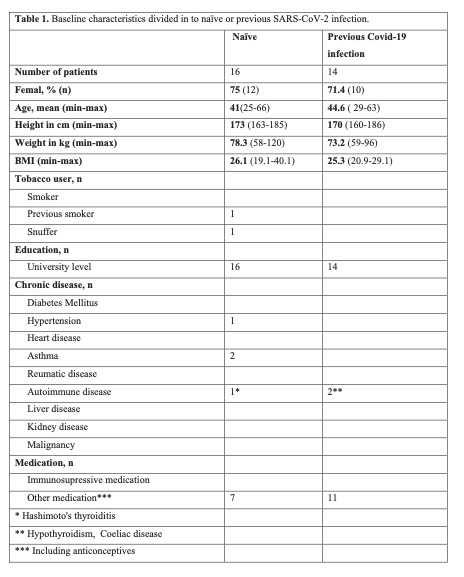

### General information

This is a dataset record for the research paper **"Modulation of innate immune response to mRNA vaccination after SARS-CoV-2 infection or sequential vaccination in humans"** led by professor Karin Loré (Karolinska Institutet) and her research group.

Author(s): Hellgren F, Rosdahl A, Arcoverde Cerveira R, Lenart K, Ols S, Gwon Y-D, Joas G, Kurt S, Delis A-M, Evander M, Normark J, Ahlm C, Forsell M, Cajander S, Loré K

Corresponding author: Karin Loré, Division of Immunology and Allergy, Department of Medicine Solna, Karolinska Institutet, Visionsgatan 4, BioClinicum J7:30, Karolinska University Hospital, 171 64 Stockholm, Sweden.
Contact e-mail: karin.lore@ki.se

DOI:\
License:\
This readme file was last updated: 2024-02-28

The dataset is available upon reasonable request through the corresponding author.

### Cohort description

The repository contains metadata for the 30 study participants recruited among health-care workers at the University hospital of Örebro, Sweden. At the start of the study, 14 individuals had a previous Covid-19 infection and 16 were infection naïve. Among the infection naïve group, 75% were female (12 out of 16 participants), with a mean age of 41 years, ranging from 25 to 66 years. In the group with previous Covid-19 infection, 71.4% were female (10 out of 14 participants), with a mean age of 44.6 years, spanning from 29 to 63 years. Study participants were sampled adjacent to each vaccine dose according to the schedule shown in Fig. 1A.

For a more detailed overview of the baseline characteristics please see Table 1 below.

### Dataset description

**Antibody titers**:\
**Immunopheotyping**: flow cytometry data a .fcs files and compiled into a excel file\
**Serum proteins**:\
**RNA-sequencing data**: RNA-seq analysis of 99 samples was performed using Illumina sequencing. Preprocessing of FASTQ raw reads was done with the nf-core/rnaseq v3.8 pipeline, with results saved in TSV format. The human genome was appended with vaccine and SARS-CoV-2 related genes prior to read alignment using STAR and gene expression quantification with Salmon.

Keywords: mRNA vaccines, innate immunity, Covid-19, coronavirus, vaccine.
